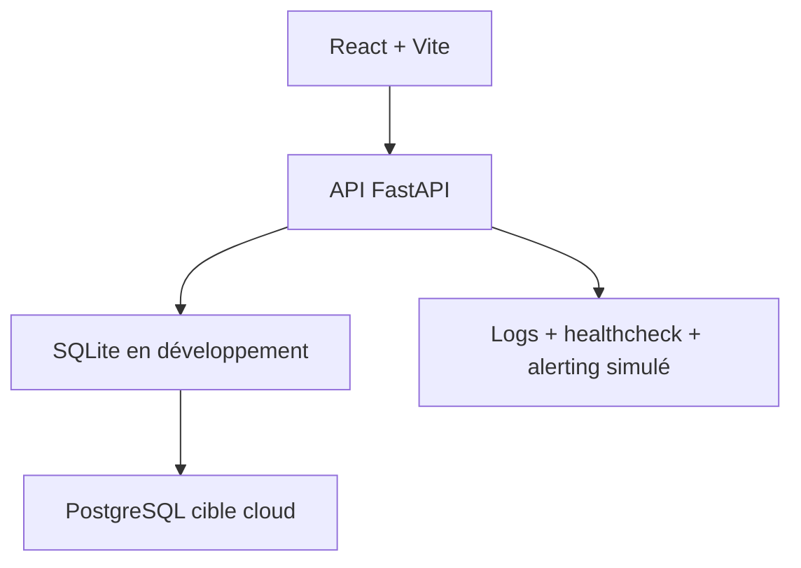

# M-Motors - Location longue durée avec option d'achat

## Contexte

M-Motors est un acteur national de la vente de véhicules d'occasion. Le projet ajoute un service de location longue durée avec option d'achat, tout en conservant le parcours d'achat existant.

L'application permet aux clients de rechercher un véhicule, de créer un compte, de déposer un dossier dématérialisé avec documents, puis de suivre son avancement. Le back-office permet aux administrateurs d'ajouter des véhicules, de les basculer entre vente et location, et de valider ou refuser les dossiers.

## Accès rapide

| Description | Valeur |
| --- | --- |
| Lien Git frontend | A renseigner après dépôt public GitHub |
| Lien Git backend | A renseigner après dépôt public GitHub |
| Lien application | A renseigner après déploiement Render/Railway/Heroku |
| Login admin | adminLocal@Motors |
| Mot de passe admin | AdminMot1! |
| Login user | userLocal@Motors |
| Mot de passe user | UserMot1! |

## Installation

Backend :

```bash
cd mmotors/backend
python -m venv .venv
.\.venv\Scripts\Activate.ps1
pip install -r requirements.txt
uvicorn app.main:app --reload
```

Frontend :

```bash
cd mmotors/frontend
npm install
npm run dev
```

URLs locales :

- Frontend : `http://localhost:5173`
- Backend : `http://localhost:8000`
- Documentation API : `http://localhost:8000/docs`
- Santé API : `http://localhost:8000/health`

## Architecture



Le projet reste volontairement simple : pas de microservices, pas de paiement, pas de file de messages. Cette architecture correspond à un premier rendu solide, maintenable et corrigeable dans le cadre d'un examen de 10 heures.

## Tests

Backend :

```bash
cd mmotors/backend
pytest --cov=app
```

Frontend :

```bash
cd mmotors/frontend
npm test
```

Les tests couvrent les comportements critiques : authentification, inscription, erreurs de connexion, véhicules, filtres achat/location, dépôt et suivi de dossier, droits admin, validation de dossier et endpoint de santé.

## Sécurité

- JWT Bearer pour les routes protégées.
- Hash des mots de passe avec bcrypt.
- Rôles `user` et `admin`.
- Validation des entrées avec Pydantic.
- Contrôle d'accès sur les routes admin.
- Formats de documents limités à PDF, PNG, JPG et JPEG.
- Variables d'environnement pour les secrets.
- Logs applicatifs et healthcheck.

## Monitoring

- `GET /health` vérifie l'état de l'API et de la base.
- `POST /health/alert-test` simule l'envoi d'une alerte.
- Les requêtes sont journalisées avec méthode, chemin, statut et durée.
- RPO retenu : 15 min.
- RTO retenu : 1 heure.

## Déploiement

Le rendu final doit pointer vers un vrai déploiement cloud, par exemple Render, Railway ou Heroku. Replit peut uniquement servir à visualiser rapidement l'application.

Variables principales :

- `DATABASE_URL`
- `JWT_SECRET_KEY`
- `CORS_ORIGINS`
- `VITE_API_URL`

Les étapes détaillées sont dans [docs/deploiement.md](docs/deploiement.md).

## Fonctionnalités

Client :

- recherche de véhicules ;
- filtre achat ou location ;
- création de compte ;
- dépôt d'un dossier ;
- téléversement de documents ;
- suivi du statut du dossier.

Admin :

- ajout de véhicules en vente ;
- ajout de véhicules en location ;
- bascule location vers vente et vente vers location ;
- consultation des dossiers ;
- validation ou refus avec commentaire.

## Captures

Les captures à intégrer au PDF final sont à placer dans `docs/captures/` :

- page de recherche ;
- dépôt de dossier ;
- suivi client ;
- administration véhicules ;
- administration dossiers ;
- endpoint `/health`.

